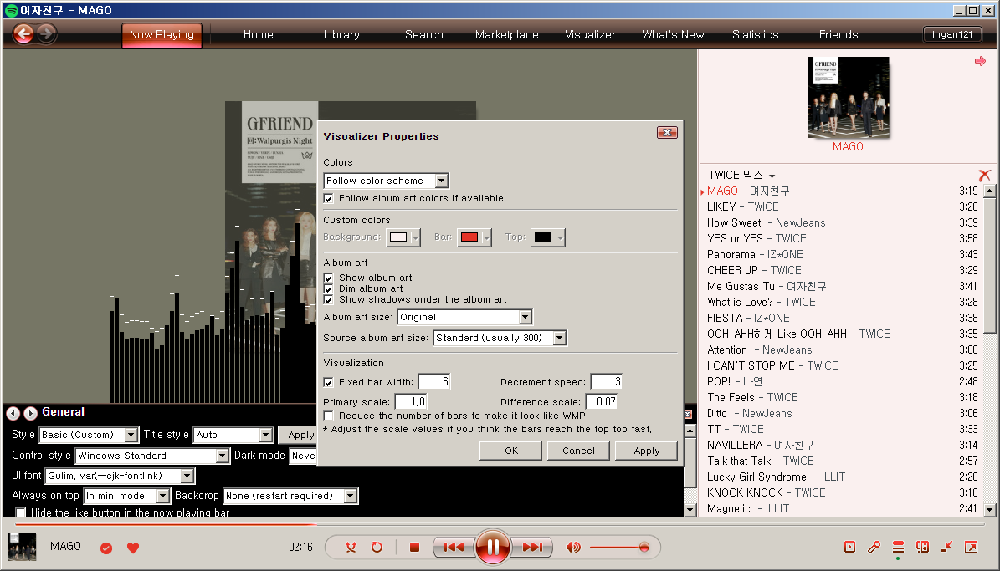
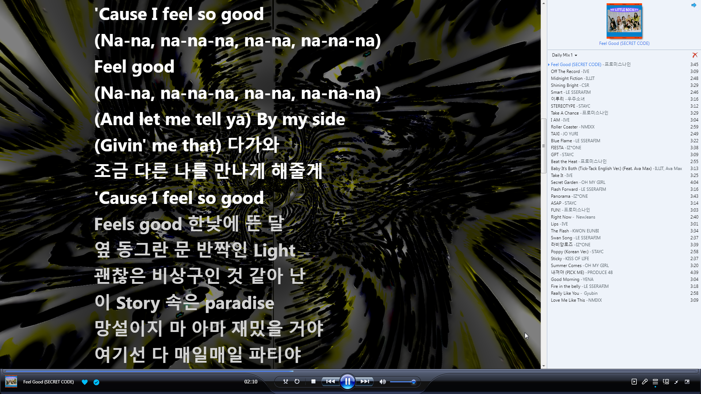

#  WMPotify
* A Windows Media Player 11 inspired Spicetify theme for Spotify
* Supported versions: 1.2.45 - 1.2.68
    * Primarily tested on 1.2.61
    * 1.2.45: `Show Global nav bar with home button, search input and user avatar` must be set to `home-next-to-search` in the experimental features
    * 1.2.44 and below are not supported

## **Installation** / Updating

### **Manual installation using Scripts (recommended):**

#### **Windows (Powershell)**

* WMPotify + WMPotify NowPlaying + Windhawk + CEF/Spotify Tweaks mod
    * This script detects whether Spotify, Spiceify, Windhawk, and CEF/Spotify Tweaks mod are installed or not. If not, it will install them.
    * If Windhawk is installed and CEF/Spotify Tweaks mod is up-to-date, the installation of these two will be skipped.

```powershell
[Net.ServicePointManager]::SecurityProtocol = [Net.SecurityProtocolType]::Tls12
iex "& { $(iwr -useb 'https://raw.githubusercontent.com/Ingan121/WMPotify/master/installer/install.ps1') }"
```

* Theme only:
```powershell
[Net.ServicePointManager]::SecurityProtocol = [Net.SecurityProtocolType]::Tls12
iex "& { $(iwr -useb 'https://raw.githubusercontent.com/Ingan121/WMPotify/master/installer/install.ps1') } -Install @('wmpotify')"
```

* WMPotify NowPlaying only:
```powershell
[Net.ServicePointManager]::SecurityProtocol = [Net.SecurityProtocolType]::Tls12
iex "& { $(iwr -useb 'https://raw.githubusercontent.com/Ingan121/WMPotify/master/installer/install.ps1') } -Install @('wmpvis')"
```

#### **Linux/macOS (Bash)**

* WMPotify + WMPotify NowPlaying
```bash
curl -fsSL https://raw.githubusercontent.com/Ingan121/WMPotify/master/installer/install.sh | sh
```

* WMPotify NowPlaying only:
```bash
export SKIP_THEME=true
curl -fsSL https://raw.githubusercontent.com/Ingan121/WMPotify/master/installer/install.sh | sh
```

### **Manual installation**
1. Download the latest release from the [releases page](https://github.com/Ingan121/WMPotify/releases)
2. Locate Spicetify directories: use `spicetify config-dir` or `spicetify path userdata`
3. Extract the contents of the WMPotify zip to the `Themes\WMPotify` folder in the Spicetify directory. Create the `Themes\WMPotify` folder if it doesn't exist.
4. Extract the contents of the WMPotify NowPlaying zip to the `CustomApps\wmpvis` folder in the Spicetify directory. Create the `CustomApps\wmpvis` folder if it doesn't exist.
5. Run the following commands in Command Prompt / PowerShell / Terminal:
    ```cmd
    spicetify config inject_css 1 replace_colors 1 overwrite_assets 1 inject_theme_js 1
    spicetify config current_theme WMPotify
    spicetify config custom_apps wmpvis
    spicetify apply
    ```
6. Windows only: Install [Windhawk](https://windhawk.net/) and [CEF/Spotify Tweaks mod](https://windhawk.net/mods/cef-titlebar-enabler-universal) for the full experience (optional but recommended)

### **Using Spicetify Marketplace (simpler installation):**

1. Install the `spicetify-marketplace` extension following its instructions: [https://github.com/spicetify/marketplace/wiki/Installation](https://github.com/spicetify/marketplace/wiki/Installation).
2. Search for "WMPotify" in the Spicetify Marketplace and click "Install."
* Warning: The Spicetify Marketplace version may load slowly due to the large number of images in the theme.

### Notes for Windows 7, 8, and 8.1 users:
* The installation script requires PowerShell 5.1 or later. If you are using an older version, you can update it from [here](https://loadspot.pages.dev).
* Before running the installation script, you will need to install WMPotify-compatible versions of Spotify and Spicetify manually and apply appropriate workarounds (e.g. [VxKex](https://github.com/i486/VxKex)) for them to work on your system.
* You may need to run the Spotify executable with the `--no-sandbox` flag to get the Windhawk mod working properly with Aero Glass, etc. Add the flag to the Spotify shortcut, `HKCU\Software\Microsoft\Windows\CurrentVersion\Run\Spotify` (for autostart), and `spotify_launch_flags` key in `%appdata%\spicetify\config-xpui.ini` (for Spicetify).

## **Uninstallation**

### **Manual uninstallation using Scripts (recommended):**

#### **Windows (Powershell)**
```powershell
[Net.ServicePointManager]::SecurityProtocol = [Net.SecurityProtocolType]::Tls12
iex "& { $(iwr -useb 'https://raw.githubusercontent.com/Ingan121/WMPotify/master/installer/install.ps1') } -Action Uninstall"
```

#### **Linux/macOS (Bash)**
```bash
curl -fsSL https://raw.githubusercontent.com/Ingan121/WMPotify/master/installer/uninstall.sh | sh
```

### **Manual uninstallation**
1. Run the following commands in Command Prompt / PowerShell / Terminal:
    ```cmd
    spicetify config custom_apps wmpvis-
    spicetify config current_theme marketplace
    spicetify apply
    ```
    Replace the second line with `spicetify config current_theme " "` if you don't plan to use themes from the Spicetify Marketplace, or you don't have Marketplace installed.
2. Delete the `Themes\WMPotify` and `CustomApps\wmpvis` folders in the Spicetify directory. Find the directory with `spicetify config-dir` or `spicetify path userdata`.

## Frequently Asked Questions
1. **Q:** Queue list does not show up in the right panel
    * **A:** Check `Enable Queue on the right panel.` in the user button -> `Experimental features`.
    * If this still does not work and the Experimental features popup shows `Using fallback mode`, you need to downgrade Spotify to a version fully supported by Spicetify. Old releases are available [here](https://docs.google.com/spreadsheets/d/1wztO1L4zvNykBRw7X4jxP8pvo11oQjT0O5DvZ_-S4Ok/edit?pli=1&gid=803394557#gid=803394557)
2. **Q:** Aero Glass or the mini mode does not work
    * **A:** Currently those features are only available on Windows, and if you have installed the [CEF/Spotify Tweaks](https://windhawk.net/mods/cef-titlebar-enabler-universal) [Windhawk](https://windhawk.net/) mod. macOS is not supported now, and it needs more research to implement them.
    * For Linux, you can use [libcef-transparency-linux](https://github.com/fixpointer/libcef-transparency-linux) by [fixpointer](https://github.com/fixpointer) to enable transparency. You may need to apply additional mods like force blur.
    * For the mini mode, you might get it working by force resizing the window to a smaller size with an external tool. I will implement a custom miniplayer in the future that looks like the mini mode.
    * KDE users: [You can get the mini mode working with Window Rules](https://github.com/Ingan121/WMPotify/issues/31).
3. **Q.** Custom title bar only shows the close button
    * **A.** Either the CEF/Spotify Tweaks Windhawk mod or the Spotify API Extender Chrome extension is required for the minimize/maximize/restore buttons to show up. The extension is available in the [SpotifyCrExt](/SpotifyCrExt) folder in the repository.
    * Using the extension is only recommended if you cannot use the Windhawk mod, such as on Linux or macOS.
    * To install the extension, you have to enable DevTools with `spicetify enable-devtools`, right-click any empty space, click `Show Chrome Tools`, open `chrome://extensions`, enable developer mode, and load the unpacked extension. If the extension installation doesn't work, run `spicetify enable-devtools` again and try again.
    * Note that Chrome extensions only work if DevTools is enabled. Spotify will randomly disable DevTools after a while and all extensions will stop working. To permanently enable DevTools and extensions, hex-patch the Spotify executable to fill the `disable-extensions` string to something invalid.
4. **Q:** This theme is too slow!
    * **A1:** Make sure hardware acceleration is enabled in Spotify settings. 
    * **A2:** Remove the Beautiful Lyrics extension if you have it installed. This extension is known to slow down Spotify. Use WMPotify NowPlaying instead.

## Switching Between Custom and Native Title Bar
* This only applies to Windows users with the CEF/Spotify Tweaks mod installed.
* To use the native Windows title bar:
    * Open the Windhawk UI and go to the details page of the CEF/Spotify Tweaks mod.
    * Go to the Settings tab and enable the `Enable native frames and title bars on the main window*` option.
    * Restart Spotify.
    * In the WMPotify Properties, set the `Title style` to either `Auto` or `Native` and apply the changes.
* To use the custom title bar (WMP11 XP styled):
    * Open the Windhawk UI and go to the details page of the CEF/Spotify Tweaks mod.
    * Go to the Settings tab and disable the `Enable native frames and title bars on the main window*` option.
    * Restart Spotify.
    * In the WMPotify Properties, set the `Title style` to `Custom` and apply the changes.
    * It is also recommended to set the `Style` to either `Auto` or `XP` for the best experience with the custom title bar.

## **Screenshots**

### Home

* Aero


* Aero (Dark mode)


* Basic


* XP


* XP with native title bar


* Classic

Either enable the transparency option in the CEF/Spotify Tweaks mod settings and use the `Aero` style, or use the `Basic (Custom)` style and set the colors manually.

* High Contrast

(Requires Chrome runtime on Spotify 1.2.45 and 1.2.46. Run Spotify.exe with `--enable-chrome-runtime` flag if the high contrast mode is not working.)

### Mini Mode

* Aero

    

* Basic

    

* XP

    

* Classic

    

### Now Playing

* Aero


* Basic


* XP


* Menu


* Bars Visualization


* Options


### Library

* Compact


* List


* Grid


### Settings

* General


* Color Customization


* Playback Speed Control

(This requires the x64 Windows version of Spotify, and the CEF/Spotify Tweaks Windhawk mod)

### Full Screen

* Aero / Basic

(I know this is Windows Media Player 12, but I don't like Vista WMP11 fullscreen design)

* XP


### Others

* Playlist


* Playlist (Scrolled)


* Search


* Discography


## TODO
* More customizable lyrics options
    * Colors, fonts, etc.
    * Probably gotta just bring the MADVis Lyrics config window code
* More skins
    * WMP10-ish one from [this wmploc mod](https://www.deviantart.com/fediafedia/art/WMP-11-Vista-Beta-76164120)
    * Bitmap-less skin with colors and SVG icons only (WMPotify Lite?)
* Custom Miniplayer implementation with XP WMP11 mini mode look, based on documentPictureInPicture
* Make the bars visualization more smoother
    * Weighted interpolation?

## Credits
* [Spicetify](https://spicetify.app/)
* [Spotify](https://www.spotify.com/)
* Several resources from Windows Media Player / Microsoft Windows by Microsoft Corporation
* For various controls like buttons, menus, etc.:
    * [7.css](https://khang-nd.github.io/7.css) by Khang-ND
    * [XP.css](https://botoxparty.github.io/XP.css/) by botoxparty
    * [98.css](https://jdan.github.io/98.css/) by jdan
    * My forks of these three from ModernActiveDesktop were used too
    * 10 style is my own work based on 7.css
* For WMPotify NowPlaying visualizations:
    * Some codes from [spicetify-visualizer](https://github.com/Konsl/spicetify-visualizer) by Konsl
    * [Butterchurn](https://butterchurnviz.com/) by Jordan Berg, based on [MilkDrop](https://en.wikipedia.org/wiki/MilkDrop) by Geiss
    * Some codes from [Butterchurn adaptation for Wallpaper Engine](https://steamcommunity.com/sharedfiles/filedetails/?id=2962616483) by SeiferX7
* Some inspiration from [this concept image](https://x.com/tehmondspartan/status/1671430592087613441) by MondySpartan (user button, lyrics overlay on top of visualization, etc.)
* Dark mode inspirations:
    * General look: above concept image
    * Controls (Aero & the classic scheme): the Dark7 theme from [21h2to7](https://www.deviantart.com/imswordqueeen/art/Windows-10-21H2-22H2-to-7-Transformation-Pack-1081353677) by ImSwordQueeen
    * Controls (10): Windows 10 Win32 dark mode controls
* Installation PowerShell script from [Spicetify-Lucid](https://github.com/sanoojes/Spicetify-Lucid) by sanoojes
* [font-detective](https://github.com/1j01/font-detective) by 1j01
* Some codes are from my previous [ModernActiveDesktop](https://github.com/Ingan121/ModernActiveDesktop) project, including the bars visualization and the lyrics engine
* For the CEF/Spotify Tweaks mod:
    * [Windhawk](https://windhawk.net/)
    * [Visual Studio Anti-Rich-Header](https://windhawk.net/mods/visual-studio-anti-rich-header) by m417z
    * [Chrome UI Tweaks](https://windhawk.net/mods/chrome-ui-tweaks) by Vasher
    * [Chromium Embedded Framework](https://bitbucket.org/chromiumembedded/cef)
    * [Chromium](https://www.chromium.org/)
